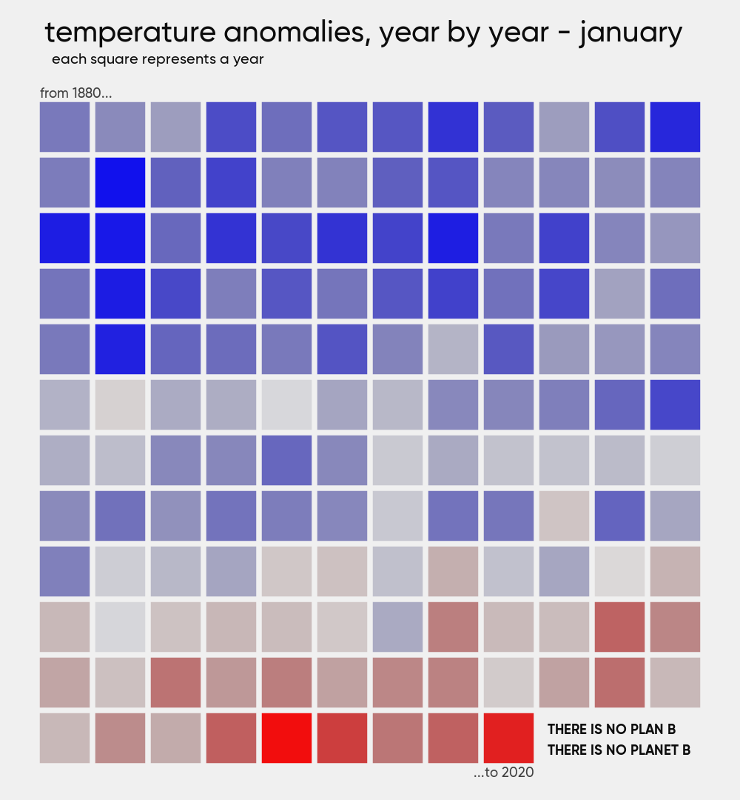
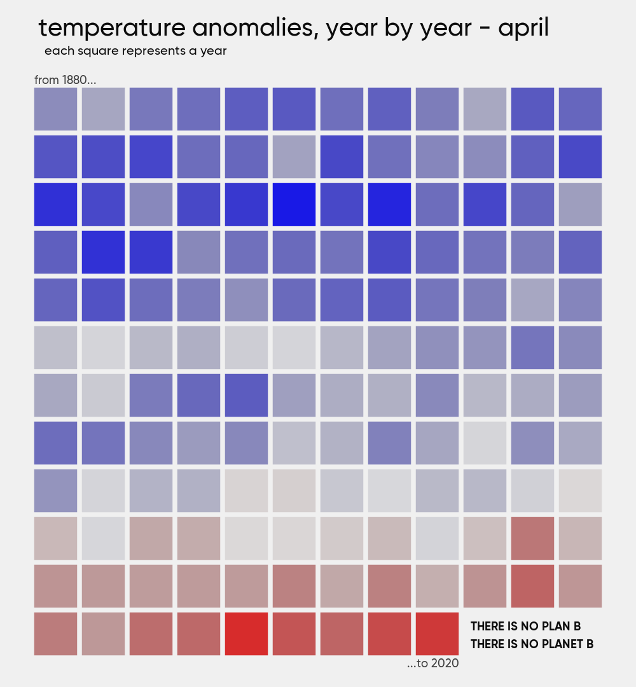
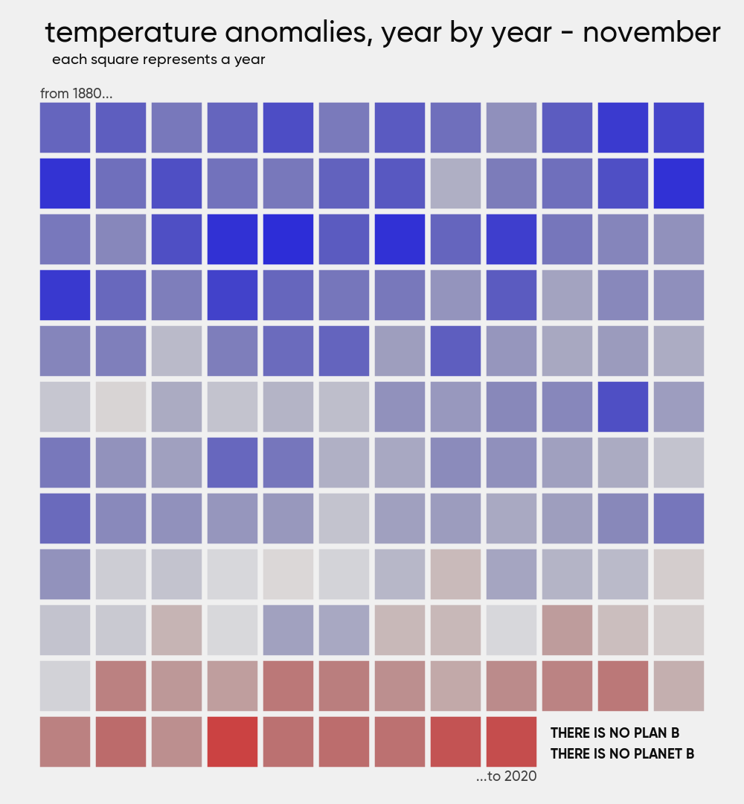
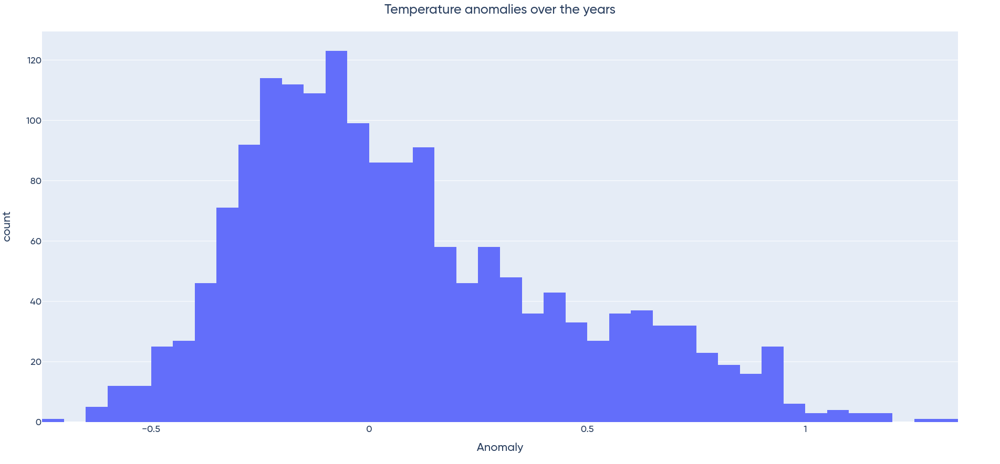
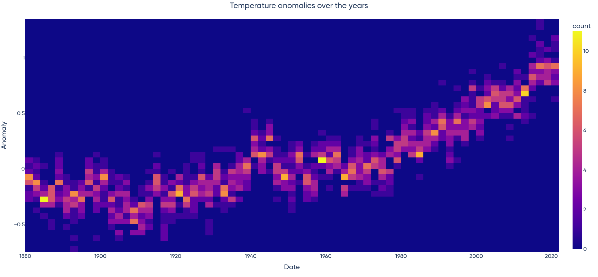
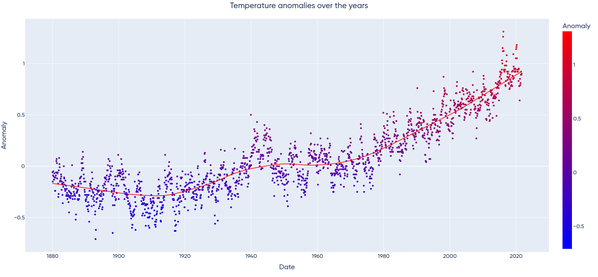

# Global Warming

Our planet is getting warmer, there's no doubt about it.

Ever since Al Gore published his famous book [*An uncomfortable truth*](https://en.wikipedia.org/wiki/An_Inconvenient_Truth_(book)), there's at least been some slight recognition about the issues that the global warming is causing us.

Sadly for the sake of the whole humanity, no effective action has even been taken. Both the [1992 Rio Earth Summit](https://en.wikipedia.org/wiki/Earth_Summit) and the [1997 Kyoto protocol](https://en.wikipedia.org/wiki/Kyoto_Protocol) basically went under the radar. Despite the best promisees and intentions of the world leaders, they have had minimal impact on global warming.

I feel that people are not realizing how bad this is going to be for us. We, as a human specie, are too greedy to change our rich and consumerist way of life in order to revert the impending climatic disaster.

While something is actually moving, like the [Fridays for future movement](https://en.wikipedia.org/wiki/School_Strike_for_Climate), the governments of some of the most polluting countries are still [denying that global warming is real](https://www.nytimes.com/2020/11/09/climate/trump-legacy-climate-change.html) or they [simply decided to not care](https://www.cnbc.com/2021/11/02/chinas-coal-shortage-eases-after-beijing-steps-in-cba-report-shows.html) for the sake of economy.

I'm not trying to push a *communist* or *anti capitalist* agenda, but I firmly believe we are putting aside the most important and least replaceable thing we have *(our planet)* in order to make our economies run faster. We have to act fast, we have to act now.

## That's depressing

*But wait, there's more!*

The [GOP26](https://en.wikipedia.org/wiki/2021_United_Nations_Climate_Change_Conference), the world leaders conference, the big thing that was meant to save us from utter and complete climatic disaster, [has failed](https://www.dw.com/en/cop26-world-leaders-fail-to-honor-climate-pledge/a-59812348).

Meanwhile, average earth temperature has risen by [almost 1.5 °C in the last 170 years](https://upload.wikimedia.org/wikipedia/commons/d/db/Global_Temperature_And_Forces.svg), [with a peak increase of more than 4 °C in the north pole](https://upload.wikimedia.org/wikipedia/commons/8/88/Change_in_Average_Temperature.svg).

I decided to visualize this increase in a somehow interesting way, to at least try and easy the huge psychological toll that this matter is causing me. It has always helped me, as it makes me understand what is really going on.

## Code output

I have analysed the temperature anomalies dataset from [NOAA](https://www.ncdc.noaa.gov) for our whole planet from 1880 to 2020. They define a temperature anomaly as *"[...] a departure from a reference value or long-term average. A positive anomaly indicates that the observed temperature was warmer than the reference value, while a negative anomaly indicates that the observed temperature was cooler than the reference value"*. Basically, if this value is higher than zero, it means that the corresponding year has been hotter than the average.

Each rectangle represents a year in that range. A temperature above the average is represented in red, while a temperature below is rendered in blue. The data is interpolated to each day of the month. The output can be seen below, in the repo (inside the `output` folder), or on my [Instagram profile](https://www.instagram.com/lorossi97).

Here below I have included a few screenshots and a choppy gif:

### Code arguments

|      *command*       |                 *description*                  | *type*  | *default* |
| :------------------: | :--------------------------------------------: | :-----: | :-------: |
|  `-d`, `--duration`  |  set the duration of the animation in frames   |  `int`  |  `1080`   |
|    `-s`, `--size`    |     size of the animation frame in pixels      |  `int`  |  `1000`   |
| `-t`, `--title-size` |       size of the title frame in pixels        |  `int`  |   `80`    |
|   `-b`, `--border`   |      percent of the canvas used as border      | `float` |   `0.1`   |
|      `--debug`       | if set, renders only the first frame and quits | `bool`  |  `false`  |

The generated frames were then stitched together with `FFMPEG`.

## Plots

Not ~~happy~~ *depressed* enough, I decided to make one more step and rendere a few plots of the data. They really tell us *an uncomfortable truth*.

## Credits

This project is distributed under Attribution 4.0 International (CC BY 4.0) license.

Monthly temperature anomalies data by [NOAA](https://www.ncdc.noaa.gov/monitoring-references/faq/anomalies.php#anomalies)

`clear && rm output/frames/*.png && python3 main.py && cd output/ && makevideo && cd .. && clear && echo -e "All done! \a"`
